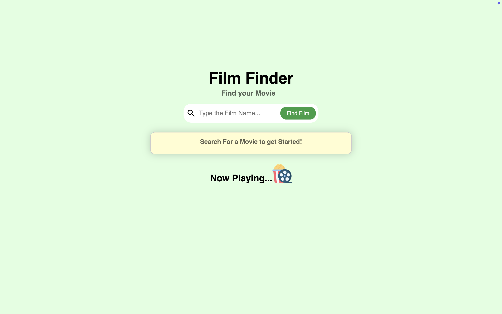
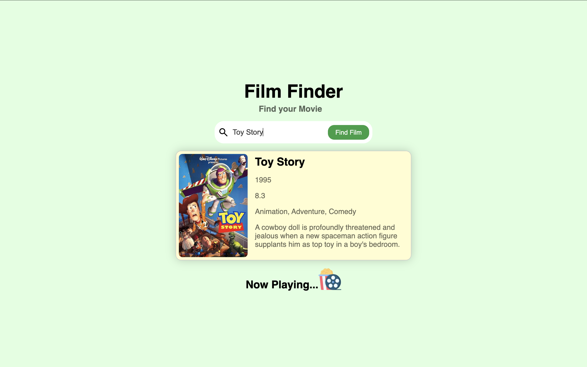

# 🎬 Film Finder

Film Finder is a sleek and responsive movie search app that lets users quickly discover information about any film using the OMDb RESTful API. Built with JavaScript and CSS Flexbox, it dynamically displays movie details like title, poster, release year, genre, IMDb rating, and plot.

---

## Features

- Search for any movie by title
- View movie summary card with:
  - Poster
  - Release year
  - Genre
  - IMDb rating
  - Plot description
- Default prompt card for first-time visitors
- Responsive and mobile-friendly layout
- Smooth, real-time updates without reloading the page

---

## Technologies Used

- **HTML5** – Semantic structure
- **CSS3** – Styling with Flexbox and responsive layout
- **JavaScript (ES6+)** – DOM manipulation and fetch API
- **OMDb API** – External movie database API

---

## Lessons Learned

This project was built to strengthen front-end development skills, including:

- Making asynchronous API calls
- Updating the DOM dynamically based on user input
- Structuring reusable components
- Creating responsive layouts using CSS Flexbox

---

## Setup & Usage

1. Clone the repository:
   ```bash
   git clone https://github.com/yourusername/film-finder.git
   ```
2. Navigate into project directory:

   ```cd film finder

   ```

3. To run this project, you will need a free api key from the OMDb API:

4. Go to https://www.omdbapi.com/apikey.aspx to get a free API key.

5. Sign up with your email and select the free plan.

6. You will recieve an email API key (usually within a few minutes).

7. Insert your api Key in the app.js file, there will be a comment telling you where to place it.

8. Save your file and open Index.html in your browser.

## Screenshots




## License

This project is licensed under the MIT License.

## Acknowledgments

- OMDb API – for providing an easy-to-use movie data API.
- Inspiration from modern movie search UIs.
- Figma - for giving me a boiler plate to build upon.
